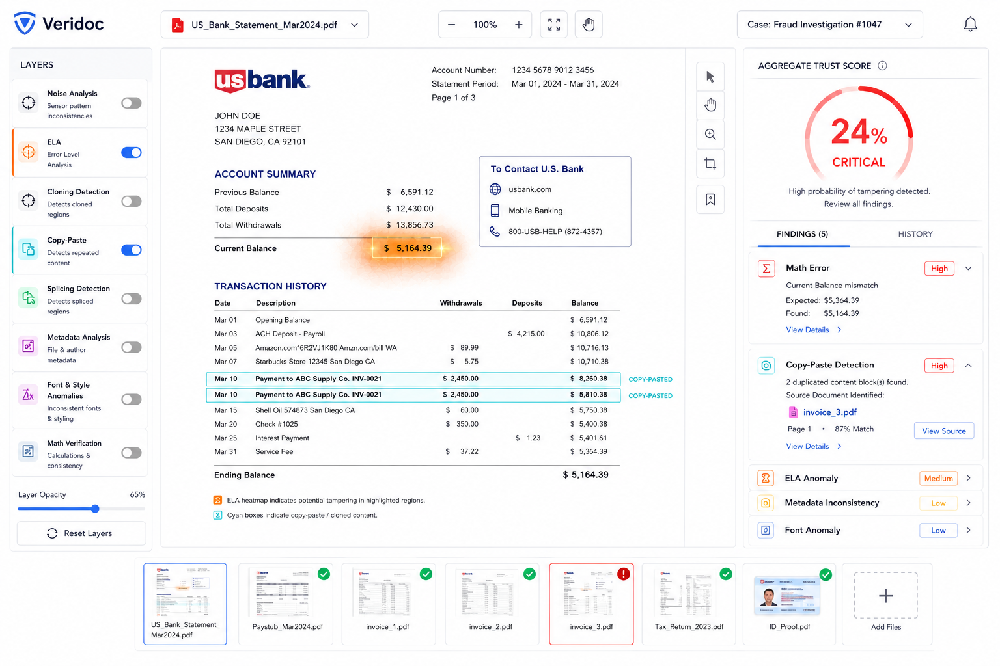
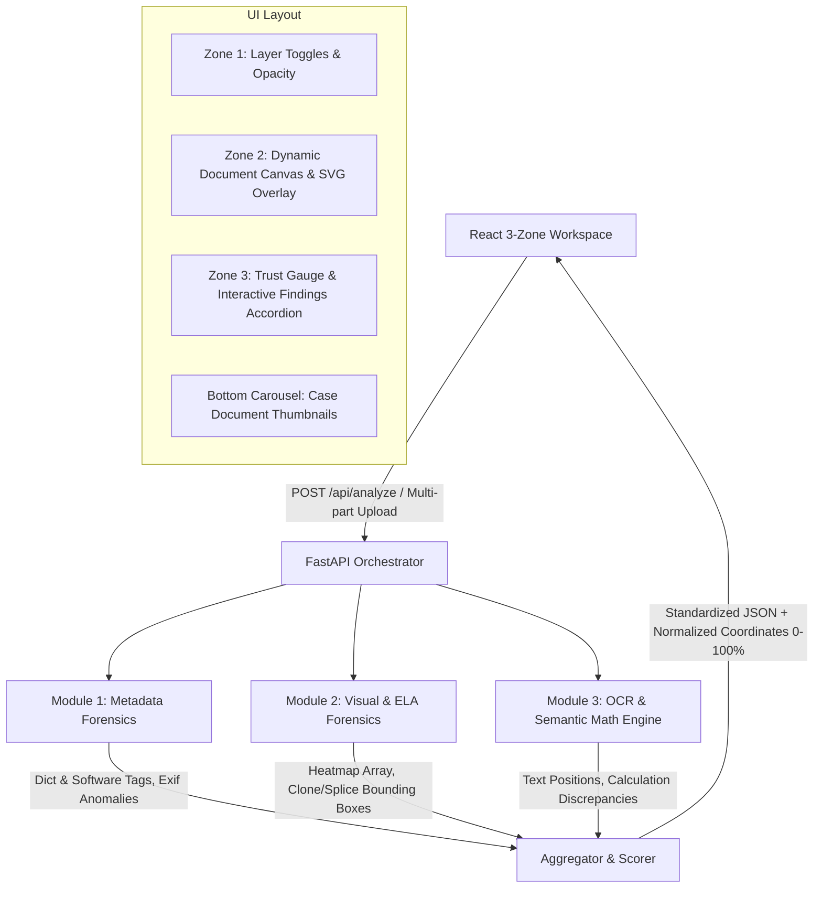

# Veridoc 🛡️
### Automated Document Fraud Detection & Forensic Verification System

[](https://python.org)
[](https://fastapi.tiangolo.com)
[](https://react.dev)
[](https://vitejs.dev)
[](https://opencv.org)
[](https://pymupdf.readthedocs.io)
[](https://pytest.org)

**Veridoc** is an enterprise-grade forensic document verification and fraud detection platform. It combines decoupled Python forensic micro-modules orchestrated by a high-performance FastAPI backend with an interactive React **3-Zone Master-Detail forensic workspace**.

---

## 📸 Workspace Overview



---

## 🌟 Key Features

### 1. Forensic Micro-Modules (Python & FastAPI)
- **Module 1: Metadata Forensics** (`PyMuPDF` + `Pillow`)
  - Inspects internal PDF dictionaries and EXIF headers.
  - Flags manipulation software signatures (e.g., *Adobe Photoshop*, *Canva*, *GIMP*, *Sejda*, *iLovePDF*).
  - Identifies temporal paradoxes (e.g., Modification date preceding Creation date).
- **Module 2: Visual & ELA Forensics** (`OpenCV` + `NumPy`)
  - **Error Level Analysis (ELA)**: Resaves at 90% JPEG quality, computes absolute error matrices, and generates normalized radiant heatmaps.
  - **Copy-Paste & Cloning Detection**: Identifies duplicated graphical elements or transaction rows across pages and reference documents.
  - **Noise & Splicing Analysis**: Measures Laplacian high-frequency variance to uncover sharp splice boundaries.
- **Module 3: OCR & Semantic Math Engine** (`PyMuPDF` / `OCR` + Semantic Parsers)
  - Extracts spatial bounding boxes for financial tables, dates, and amounts.
  - **Arithmetic Consistency Verification**:
    $$\text{Previous Balance (\$6,591.12)} + \text{Deposits (\$12,430.00)} - \text{Withdrawals (\$13,856.73)} = \mathbf{\$5,364.39}$$
    *Tampered text prints:* $\mathbf{\$5,164.39}$ $\rightarrow$ Flags $-\$200.00$ balance mismatch.
  - **Font & Style Anomaly Detection**: Checks for baseline deviations, irregular font weights, and mismatched glyph metrics.

### 2. React 3-Zone Master-Detail Forensic Workspace
- **Zone 1 (Left 15% - Layer Controls)**:
  - Toggle switches for 8 forensic layers (*Noise Analysis*, *ELA*, *Cloning*, *Copy-Paste*, *Splicing*, *Metadata*, *Font & Style*, *Math Verification*).
  - Smooth **Layer Opacity Slider** (0% to 100%) for real-time visual blending.
  - One-click *Reset Layers* control.
- **Zone 2 (Center 60% - Document Canvas)**:
  - High-fidelity zoomable and pannable document canvas.
  - **Dynamic Glowing ELA Heatmap**: Amber/orange radiant heat glow over modified numeric fields.
  - **Copy-Paste Bounding Boxes**: Cyan highlight borders with `"COPY-PASTED"` pill badges.
  - **Math Error Highlights**: Animated red pulse borders on calculation errors.
  - Right-side canvas toolbar: *Select*, *Pan (Hand)*, *Zoom (Search)*, *Area Crop*, *Bookmark*.
  - Dynamic bottom canvas legend.
- **Zone 3 (Right 25% - Auditor Panel)**:
  - **Circular Radial Trust Score Gauge** (e.g., `24% CRITICAL`) with animated SVG progress ring.
  - Tabs for `FINDINGS (5)` and `HISTORY`.
  - Accordion cards with severity badges (`High`, `Medium`, `Low`), expected vs. found formulas, and source document links (`invoice_3.pdf`).
  - **Bidirectional Hover Synchronization**: Hovering over any finding card highlights the corresponding bounding box on the canvas in real-time.
- **Bottom Document Dock (Carousel)**:
  - Batch document switcher across case files with status indicators (`Verified` checkmarks, `Flagged` alerts).
  - `+ Add Files` drag-and-drop upload modal to analyze custom PDF/JPG/PNG files.

---

## 🏗️ Architecture



---

## 📁 Repository Structure

```
veridoc/
├── backend/
│   ├── app/
│   │   ├── main.py                     # FastAPI application & REST endpoints
│   │   ├── schemas.py                  # Pydantic data schemas
│   │   ├── orchestrator.py             # Multi-module asynchronous pipeline & Trust Score engine
│   │   ├── sample_cases.py             # Case #1047 sample definitions
│   │   ├── generate_samples.py         # Synthetic forensic document generator
│   │   └── modules/
│   │       ├── metadata_forensics.py   # Module 1: PDF/EXIF metadata parser
│   │       ├── visual_forensics.py     # Module 2: ELA & cloning detector
│   │       └── ocr_semantic.py         # Module 3: OCR & math validation
│   ├── sample_data/                    # Sample PDFs (Bank statement, invoices, paystub, tax return, ID)
│   ├── tests/
│   │   └── test_forensics.py           # Automated unit and integration tests
│   └── requirements.txt                # Python backend dependencies
│
├── frontend/
│   ├── src/
│   │   ├── components/
│   │   │   ├── TopNav.jsx              # Top header, zoom, pan, document selector
│   │   │   ├── Zone1Layers.jsx         # Zone 1: Layer toggles & opacity
│   │   │   ├── Zone2Canvas.jsx         # Zone 2: Document viewer & overlays
│   │   │   ├── Zone3Auditor.jsx        # Zone 3: Trust Score gauge & findings
│   │   │   ├── BottomDocCarousel.jsx   # Bottom batch document dock
│   │   │   └── UploadModal.jsx         # Drag-and-drop file upload dialog
│   │   ├── data/
│   │   │   └── mockData.js             # Initial case state & offline fallback data
│   │   ├── services/
│   │   │   └── api.js                  # Frontend API client
│   │   ├── styles/
│   │   │   └── theme.css               # Design tokens & forensic styling
│   │   ├── App.jsx                     # Master application container
│   │   ├── index.css                   # Global reset
│   │   └── main.jsx                    # React entry point
│   ├── package.json                    # Frontend dependencies (React, Vite, Lucide)
│   └── vite.config.js                  # Vite configuration
│
├── architecture.txt                    # System architectural specification
├── UI_mockup.png                       # Reference UI mockup
└── README.md                           # Project documentation
```

---

## 🚀 Quick Start Guide

### Prerequisites
- **Python 3.10+** (Tested on Python 3.10 - 3.14)
- **Node.js 18+** & **npm**

---

### 1. Backend Setup

1. Open a terminal in the root directory:
   ```bash
   cd b:\veridoc\backend
   ```
2. Install Python dependencies:
   ```bash
   pip install -r requirements.txt
   ```
3. Generate sample case documents (optional if already generated):
   ```bash
   python app/generate_samples.py
   ```
4. Start the FastAPI backend server:
   ```bash
   python -m uvicorn app.main:app --host 127.0.0.1 --port 8000 --reload
   ```
   > The API will be running at `http://127.0.0.1:8000`  
   > Interactive Swagger documentation available at `http://127.0.0.1:8000/docs`

---

### 2. Frontend Setup

1. Open a second terminal:
   ```bash
   cd b:\veridoc\frontend
   ```
2. Install Node dependencies:
   ```bash
   npm install
   ```
3. Start the development server:
   ```bash
   npm run dev
   ```
4. Open your browser and navigate to:
   ```
   http://localhost:5173
   ```

---

## 🧪 Running Automated Tests

Veridoc includes a comprehensive `pytest` test suite verifying all forensic micro-modules, scoring calculations, and API endpoints:

```bash
cd b:\veridoc
python -m pytest backend/tests/test_forensics.py -v
```

### Test Coverage:
- `test_metadata_forensics`: Validates PDF dictionary parsing, Photoshop tag detection, and temporal contradiction checks.
- `test_visual_ela_forensics`: Verifies ELA difference scaling, base64 PNG heatmap generation, and contour bounding boxes.
- `test_ocr_and_math_verification`: Tests balance arithmetic verification ($5,164.39 vs $5,364.39) and duplicated row matching.
- `test_full_orchestration`: Tests async multi-module aggregation and Trust Score calculation (`24% CRITICAL`).
- `test_api_health_and_analyze`: Validates live multipart `/api/analyze` upload and JSON response schema.

---

## 📡 API Reference

### `POST /api/analyze`
Accepts multipart form-data with a file (`PDF`, `PNG`, `JPG`) and runs the full forensic pipeline.

**Response Schema:**
```json
{
  "document_id": "doc-8f3b12a9",
  "filename": "US_Bank_Statement_Mar2024.pdf",
  "case_id": "Fraud Investigation #1047",
  "trust_score": 24,
  "risk_level": "CRITICAL",
  "summary": "High probability of tampering detected. Review all findings.",
  "metadata": {
    "filename": "US_Bank_Statement_Mar2024.pdf",
    "filesize_bytes": 482910,
    "page_count": 3,
    "producer": "Adobe PDF Library 16.0 / Adobe Photoshop 2024",
    "has_anomalies": true,
    "anomalies": [
      "Document modified using graphic editing software: 'Photoshop'",
      "Temporal contradiction: Modification date precedes Creation date"
    ]
  },
  "findings": [
    {
      "id": "finding-math-1",
      "layer_type": "math",
      "severity": "High",
      "title": "Math Error",
      "description": "Current Balance mismatch detected in Account Summary.",
      "expected_value": "$5,364.39",
      "found_value": "$5,164.39",
      "confidence": 0.99,
      "bounding_boxes": [
        {
          "x": 37.0,
          "y": 35.8,
          "width": 8.5,
          "height": 3.2,
          "label": "Current Balance Mismatch",
          "color": "#EF4444"
        }
      ]
    }
  ]
}
```

### Other Endpoints:
- `GET /api/health`: Health status check.
- `GET /api/cases/{case_id}`: Retrieves case documents and forensic report summaries.
- `GET /api/sample-docs`: Lists all preloaded case files in `Fraud Investigation #1047`.
- `GET /api/sample-docs/{filename}`: Executes on-demand analysis of sample documents.

---

## ⚖️ License
MIT License. Built for document fraud detection, forensic auditing, and financial risk compliance.
